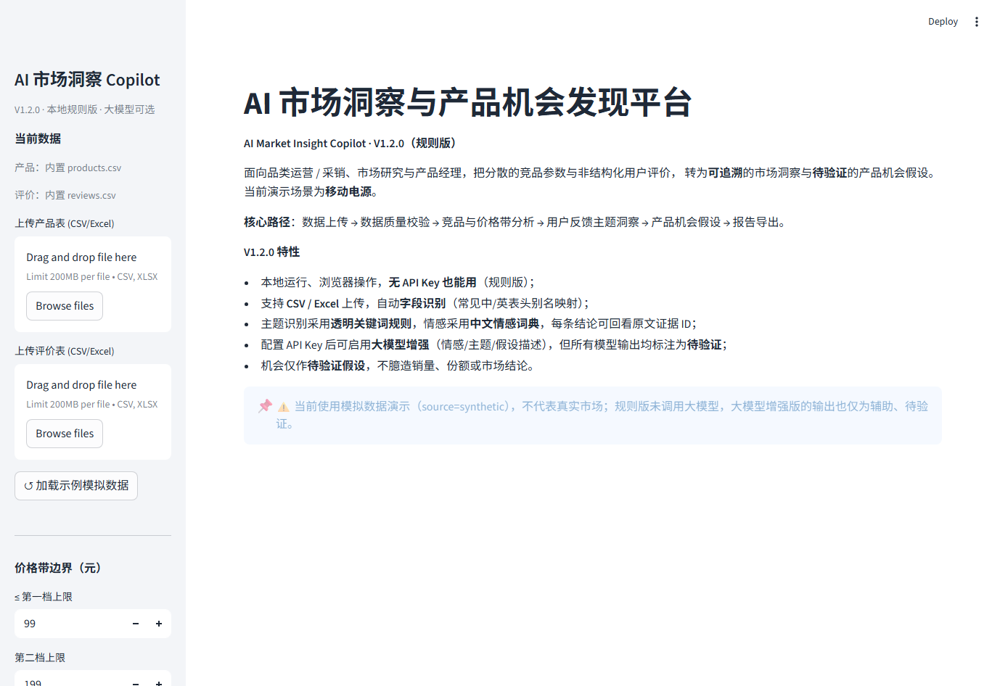
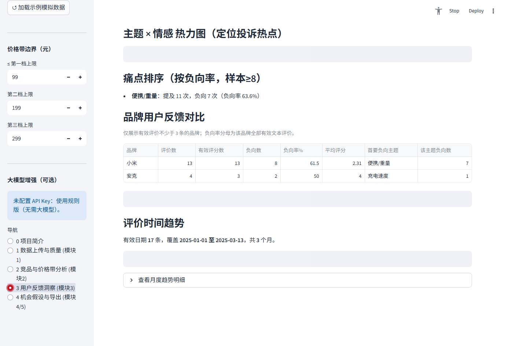
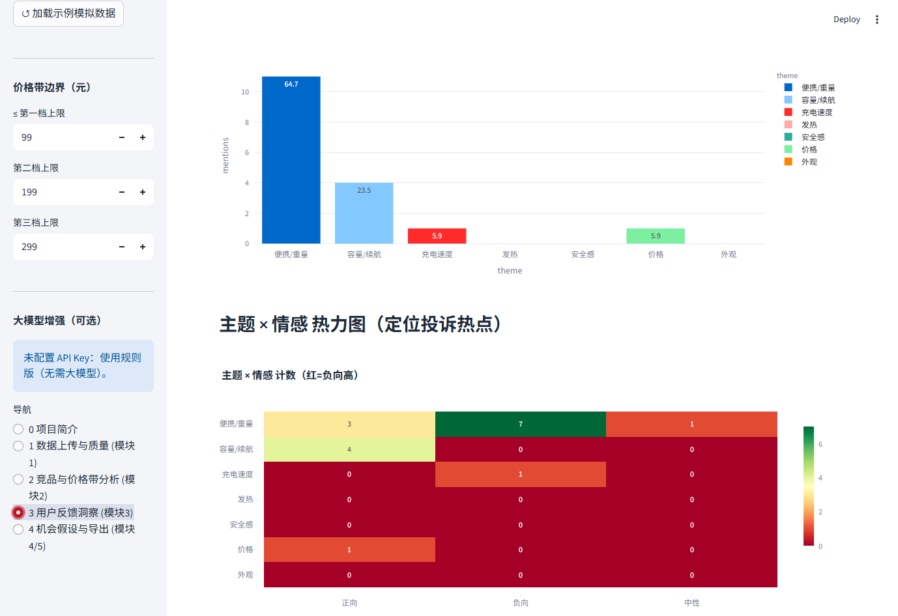
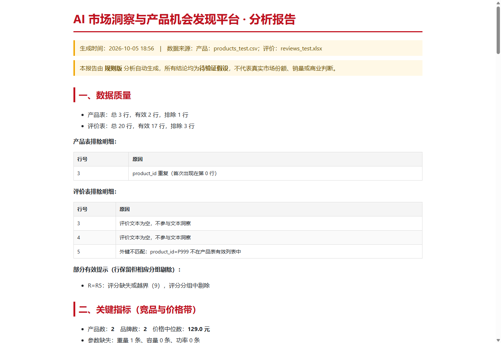

# AI 市场洞察与产品机会发现平台（AI Market Insight Copilot）· V1.2.0


[](https://github.com/zruijie55-droid/ai-market-insight-copilot/actions/workflows/tests.yml)


**源代码：** [GitHub 仓库](https://github.com/zruijie55-droid/ai-market-insight-copilot)

> **个人独立练习项目 · 规则版 + 可选大模型增强**。本地运行、浏览器操作，**无 API Key 也能用**。
> 全部演示数据均为**模拟数据（source=synthetic）**，不代表真实市场。
>
> **V1.2.0** 新增品牌用户反馈对比、品牌×负向主题热力图、月度评价量与负向率趋势、品牌证据筛选，
> 并补齐 GitHub Actions 与 Streamlit Community Cloud 发布配置。版本记录见 [CHANGELOG.md](CHANGELOG.md)。

把分散的竞品参数与非结构化用户评价，转为**可追溯**的市场洞察与**待验证**的产品机会假设。
当前演示场景：**移动电源（充电宝）**，面向**京东采销 / 产品经理 / 市场研究 / 制造业市场分析**等岗位。

核心路径：**数据上传 → 数据质量校验 → 竞品与价格带分析 → 用户反馈主题洞察 → 产品机会假设 → 报告导出**。

## 项目截图

| 首页与数据上传 | 品牌用户反馈对比 |
|---|---|
|  |  |

| 月度趋势 | HTML 分析报告 |
|---|---|
|  |  |

在线部署说明见 [DEPLOYMENT.md](DEPLOYMENT.md)。GitHub 仓库用于查看源码，Streamlit Community Cloud 链接用于直接操作应用。

---

## 1. 功能一览（对应需求 5 大模块）

| 模块 | 功能 | 状态 |
|------|------|------|
| **模块1 市场数据管理** | 上传 **CSV / Excel(.xlsx)**；**字段识别**（常见中/英文表头别名自动映射）；缺失值检查、数据类型校验、重复 ID 去重、商品关联（外键匹配）；不静默丢行，展示排除原因与样本量 | ✅ |
| **模块2 竞品分析** | 价格带分布（边界可配）、品牌价格/属性对比、**产品参数逐项对比**；容量/功率/重量 × 价格散点；按品牌/价格带筛选；不臆造销量/份额 | ✅ |
| **模块3 AI 用户需求洞察** | 透明关键词主题（便携/重量、容量/续航、充电速度、发热、安全感、价格、外观）；**中文情感词典**正负向标注；主题频次、主题×情感热力图、痛点排序、**品牌×负向主题对比**、**月度评价量与负向率趋势**；单条可多主题；未命中统计；按主题/情感/品牌查看**原文证据** | ✅ |
| **模块4 产品机会发现** | 结合用户需求（主题/情感/价格带）与竞品参数，按可解释规则生成**待验证**机会假设，标注样本量/范围/证据 ID/判断依据；绝不把推测表述为已验证事实 | ✅ |
| **模块5 AI 市场分析报告** | 整合竞品分析+用户洞察+产品机会，导出 **Markdown / HTML（含图表）/ CSV** 报告；报告内标注数据来源、数据质量、分析口径与限制 | ✅ |

**可选大模型增强（需配置 API Key）**：配置环境变量并在侧边栏启用后，情感/主题/假设描述可由大模型辅助生成（仍标注为**待验证**，绝不冒充已证实结论）。
**费用控制**：情感标注的模型调用条数受 `MAX_LLM_REVIEWS`（默认 200）上限约束，超出部分自动回退中文情感词典；界面与报告会显式披露「实际调用模型 N/M 条」，避免评价量大时费用失控。
未配置 Key 时，全部基础功能（数据清洗 / 竞品分析 / 规则洞察）照常运行。

**明确未做（请勿在简历中写为已完成）**：复杂多 Agent、MCP、自动爬虫、用户登录系统、PDF/Word 导出、制造业/储能行业实测数据集验证。

---

## 2. Windows 本地运行（PowerShell 逐步）

> 需要 **Python 3.9+**（本地已在 Python 3.9.13 验证；建议优先使用仍受官方支持的较新版本）。

```powershell
# 1) 进入项目目录（请改成你的实际路径）
cd D:\projects\ai_market_insight

# 2) 创建并激活虚拟环境
python -m venv .venv
.venv\Scripts\Activate.ps1
# 若提示“无法加载脚本因为禁止运行脚本”，先执行：
Set-ExecutionPolicy -Scope Process RemoteSigned

# 3) 安装依赖
pip install -r requirements.txt

# 4) 启动（默认自动加载内置模拟数据，无需任何 Key）
streamlit run app.py

# 5) 浏览器打开终端显示的地址，通常是：
#    http://localhost:8501
```

**macOS / Linux** 对应命令：
```bash
cd ai_market_insight
python3 -m venv .venv && source .venv/bin/activate
pip install -r requirements.txt
streamlit run app.py
```

启动后左侧导航：`0 项目简介 → 1 数据上传与质量 → 2 竞品与价格带分析 → 3 用户反馈洞察 → 4 机会假设与导出`。首页点「加载示例模拟数据」或直接在侧栏上传你自己的两份文件即可。

### 可选：启用大模型增强
1. 安装可选依赖：`pip install -r requirements-llm.txt`
2. 复制 `.env.example` 为 `.env`：`copy .env.example .env`（macOS/Linux 用 `cp`）
3. 在 `.env` 中填入 `OPENAI_API_KEY`（以及可选的 `OPENAI_BASE_URL` / `OPENAI_MODEL`，本地模型如 Ollama 亦可）
4. 在应用侧边栏勾选「启用大模型增强」

> **安全**：`.env` 已被 `.gitignore` 排除，真实密钥不会提交。API Key 只从环境变量读取，不写入源代码。

---

## 3. 数据字典

### products.csv（每行一款竞品 SKU）
| 字段 | 类型 | 说明 |
|------|------|------|
| product_id | string | 唯一商品 ID，**必填、唯一、非空** |
| brand | string | 品牌 |
| product_name | string | 商品名称 |
| price | float | 标价（元），**须 ≥ 0** |
| capacity_mah | int | 标称容量（mAh），**须为正整数** |
| power_w | float | 标称充电功率（W），**须 > 0** |
| weight_g | float | 重量（g），**可缺失**（缺失不计入均值） |
| source | string | 数据来源；模拟数据填 `synthetic` |

### reviews.csv（每行一条用户评价）
| 字段 | 类型 | 说明 |
|------|------|------|
| review_id | string | 唯一评价 ID，**必填、唯一** |
| product_id | string | 关联产品表；**匹配不到将整行排除并提示** |
| rating | int | 1–5；可缺失（保留该行，评分分组剔除并提示） |
| review_text | string | 评价正文；**空文本整行排除**（不参与文本洞察） |
| review_date | date | 评价日期；可缺失（保留该行，日期维度剔除并提示） |
| source | string | 数据来源；模拟数据填 `synthetic` |

**字段识别**：上传表头若为中文或常见变体（如 `品牌/价格/容量/功率/重量/评分/评论/日期`），系统会自动映射到标准列名后再校验，降低上传门槛。

内置模拟数据：`data/products.csv`（40 款）、`data/reviews.csv`（423 条，含少量空文本/缺失评分/缺失日期用于演示提示）。
损坏样例（用于手测校验）：`data/sample_broken_products.csv`、`data/sample_broken_reviews.csv`。

---

## 4. 项目结构与个人贡献

```
ai_market_insight/
├── app.py                  # Streamlit 入口：5 个分区的中文界面与交互编排
├── src/
│   ├── data.py             # 模块1 数据加载/字段识别/质量校验（不静默丢行）
│   ├── analysis.py         # 模块2 竞品与价格带、品牌/参数对比、散点
│   ├── insights.py         # 模块3 规则主题 + 情感 + 主题×情感热力图 + 模块4 机会假设
│   ├── sentiment.py        # 中文情感词典（VADER 风格的中文适配，零依赖）
│   ├── llm.py              # 可选大模型客户端（环境变量 Key，优雅降级）
│   └── report.py           # 模块5 Markdown / HTML 报告生成
├── data/
│   ├── generate_mock.py    # 模拟数据生成（固定随机种子，可复现）
│   ├── products.csv / reviews.csv
│   └── sample_broken_*.csv # 校验手测样例
├── tests/
│   ├── test_data.py / test_analysis.py / test_insights.py / test_sentiment.py
│   ├── test_data_excel.py  # Excel 读取 + 真实 UploadedFile 上传测试
│   ├── test_llm.py         # 无 Key 降级 + 大模型费用控制/失败回退（mock）
│   ├── test_analysis_param.py
│   ├── test_web_upload.py  # 镜像网页上传全流程的逻辑级端到端测试
│   ├── web_browser_test.py # 真实浏览器：上传+逐页浏览+截图（需 playwright）
│   ├── llm_integration_local.py  # 本地 OpenAI 兼容 mock 的集成层验证
│   ├── llm_real_call.py    # 真实大模型调用验证（无 Key 时标注「未验证」）
│   ├── _fixtures/          # 上传测试样本（products_test.csv / reviews_test.xlsx）
│   ├── run_tests.py        # 测试入口
│   └── pipeline_smoke.py   # 端到端非交互验证
├── docs/screenshots/       # README 使用的代表性界面截图
├── .github/workflows/      # GitHub Actions 自动测试
├── .streamlit/config.toml  # 云端与本地统一主题配置
├── requirements.txt       # 默认规则版 / 云端运行依赖
├── requirements-dev.txt   # 自动化测试依赖
├── requirements-llm.txt   # 可选大模型依赖
├── DEPLOYMENT.md          # GitHub + Streamlit Cloud 发布指南
├── CHANGELOG.md           # 版本记录
├── .gitignore             # 已排除密钥、虚拟环境与本地测试产物
├── .env.example            # 大模型可选配置模板（不含真实密钥）
├── 修复说明_V1.1.1.md      # V1.1.1 历史修复记录
├── LICENSE                 # MIT
├── THIRD_PARTY_NOTICES.md  # 第三方/开源合规声明
└── README.md
```

**个人贡献**：从需求拆解到完整实现——数据校验的不静默丢行与样本量展示、字段识别与去重、
价格带可配分析、透明可审计的关键词主题与中文情感词典、主题×情感热力图与痛点排序、基于规则
的可解释机会假设，以及可选的、受环境变量管控的大模型增强层；配套测试、模拟数据与演示数据。

---

## 5. 测试与验证（实测结果）

```powershell
# 单元/边界测试（64 passed）
python tests/run_tests.py

# 端到端非交互验证（内置模拟数据跑通 模块1–5 并生成报告）
python tests/pipeline_smoke.py

# 网页上传流程的逻辑级端到端（真实 UploadedFile 对象）
python tests/test_web_upload.py

# 真实浏览器：启动 Streamlit → 上传 CSV/XLSX → 逐页浏览 → 截图（需 pip install playwright）
python tests/web_browser_test.py

# 大模型集成层验证（本地 OpenAI 兼容 mock，非真实模型调用）
python tests/llm_integration_local.py

# 真实大模型调用验证（需先配置 OPENAI_API_KEY；无 Key 时输出「未验证」）
python tests/llm_real_call.py
```

**实测结论（非虚构；本地日志位于被 Git 忽略的 `output/logs/`）**：

| 项目 | 结果 |
|------|------|
| 单元/边界测试 | **64 passed / 0 failed**（覆盖字段缺失、重复 ID、无效数值、外键不匹配、空评价、**缺失评价 NaN 清洗**、单条多主题、零分母、空数据、情感标注、**品牌反馈与小样本排除**、**月度趋势与无效日期排除**、Excel 读取、参数对比、**价格带边界与页面阻断校验**、**HTML 报告结构、转义与图表位置**、**云端部署完整性**、**真实 UploadedFile 上传**、**大模型费用控制/失败回退**等） |
| 端到端管线 | 40 款产品全部有效；423 条评价中 1 条空文本被排除、2 条部分有效被提示（有效 422）；价格中位数约 209 元；文本洞察 422 条、未命中主题 4 条；生成 6 条待验证机会假设，成功导出 MD/HTML 报告 |
| 网页端（真实浏览器） | 11/11 步通过：上传 CSV/Excel → 字段识别 → 清洗 → 竞品分析 → 用户洞察 → 机会假设 → **报告真实下载**（下载文件含「情感分布」「待验证」，非仅 HTTP 200） |
| 大模型集成层 | 请求 → 响应解析（情感/主题/假设润色）→ 模型报错自动回退 → 费用控制，**全部通过**（本地 mock，非真实模型） |
| 大模型真实调用 | **未验证**：当前环境未配置 `OPENAI_API_KEY`、无本地 Ollama、无对外网络，无法发起真实调用，**不声称已通过真实模型实测** |

> 说明：未做人工标注的真实/授权测试集评估，因此**不声称任何准确率、提效百分比或企业使用效果**。

**公开仓库保留的代表截图**（`docs/screenshots/`）：

| 截图 | 内容 |
|------|------|
| `home.png` | 首页与上传入口 |
| `brand-feedback.png` | 品牌反馈表格与负向主题热力图 |
| `time-trend.png` | 月度评价量与负向率趋势 |
| `html-report.png` | 浏览器打开的独立 HTML 报告 |

---

## 6. 项目边界与诚实声明（简历/面试务必遵守）

- V1.2.0 的默认模式仍为主题/情感**规则版**（透明关键词 + 中文情感词典），**存在误判与漏判**；未命中主题的评价已在报告中统计披露。
- 不臆造销量、市场份额、销售额；机会**仅为假设**，需结合人工研判与进一步验证。
- 大模型增强为**可选能力**：其输出是**辅助性、待验证**的，不得表述为已证实的市场事实；简历中如提及，须如实说明是「规则版 + 可选 LLM 增强（待验证）」。
- **大模型真实调用尚未实测**：当前开发环境无可用 API Key / 无本地模型 / 无外网，仅验证了集成层代码路径（本地 mock）与无 Key 优雅降级。**不得声称「AI 增强已通过真实模型实测」**；如他人质疑，应如实说明「规则版 + 可选 LLM 增强（待验证，未实测真实调用）」。
- 制造业/储能场景仅作**演示设想**，在增加独立工业样例并验证前不可写为「已适用」。
- 数据均为模拟（synthetic），**不代表真实市场**，不得用于商业判断。

---

## 7. 常见报错与处理

| 现象 | 原因 / 处理 |
|------|------|
| PowerShell 无法激活 venv | 执行 `Set-ExecutionPolicy -Scope Process RemoteSigned` 后重试 |
| 上传后提示「缺少必填列」 | 列名需与数据字典一致（程序已支持常见中文别名，如 `品牌/价格/容量/评分/评论`） |
| 上传 .xlsx 提示缺 openpyxl | `pip install openpyxl`（已列入 requirements） |
| 图表区显示表格而非图 | 未安装 plotly；`pip install plotly`（已自动包含） |
| 端口被占用 | 启动时指定 `streamlit run app.py --server.port 8503` |
| 上传 GBK 编码 CSV 乱码 | 程序已兼容 UTF-8-SIG/UTF-8/GBK；如仍异常请另存为 UTF-8 |
| 评价大量被排除 | 多为 review_id 重复 / 外键不匹配 / 空文本，详见「数据上传与质量」页的排除明细 |
| 启用大模型增强报错 | 检查 `.env` 中 `OPENAI_API_KEY` 与 `OPENAI_BASE_URL`；任何失败都会自动回退规则版 |

---

## 8. 开源与引用

- 本项目以 **MIT 许可证**发布（见 `LICENSE`）。
- **参考项目** `shrutisurya108/Amazon-Review-Intelligence`：经 GitHub API 核验，该仓库**发布时无 LICENSE 文件（保留所有权利）**，故本项目**未复制其任何源代码**，仅借鉴其「词典情感 + 主题建模 + 主题×情感热力图定位投诉热点」的方法论，并针对中文移动电源场景自主实现等价功能。详细说明见 `THIRD_PARTY_NOTICES.md`。
- 运行时依赖（pandas / Streamlit / Plotly / openpyxl / openai 等）各自遵循其开源许可证，见 `THIRD_PARTY_NOTICES.md`。
- 报告与代码中不包含任何真实企业内部数据、用户隐私或未经授权抓取内容。
